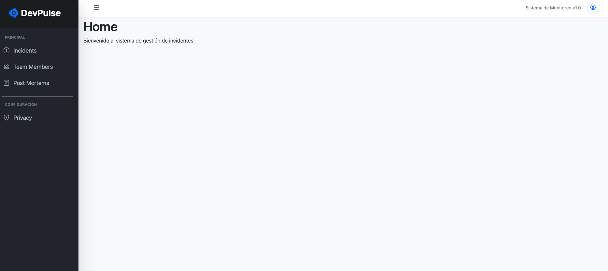
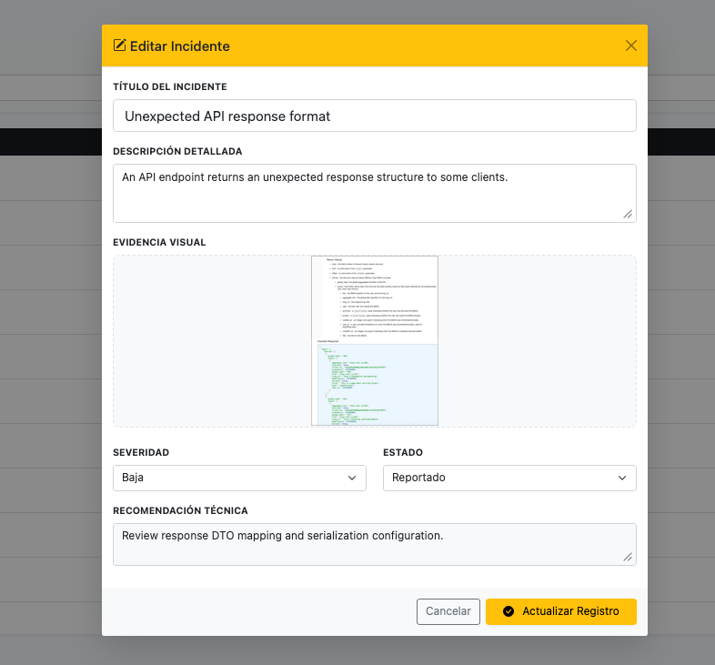
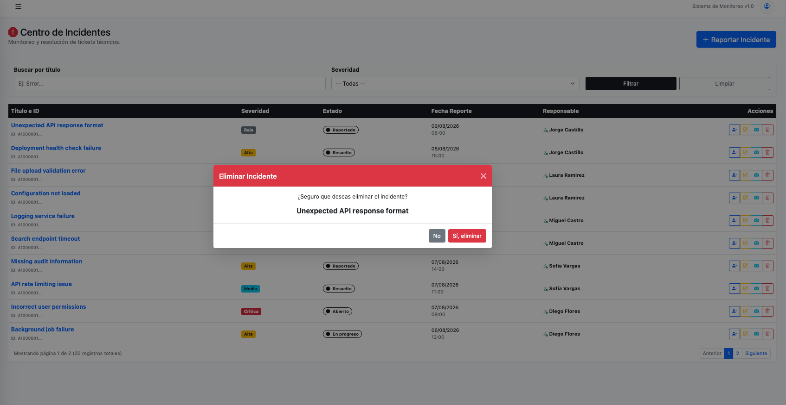
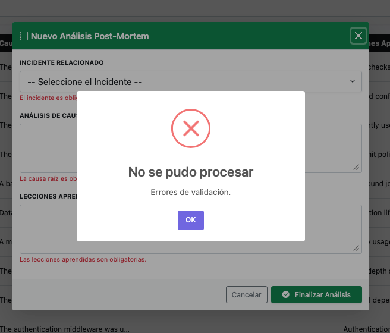
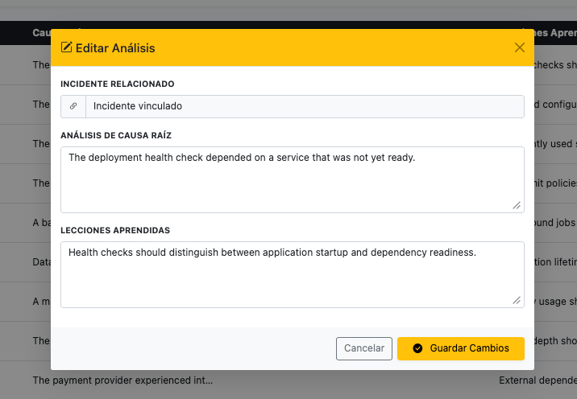
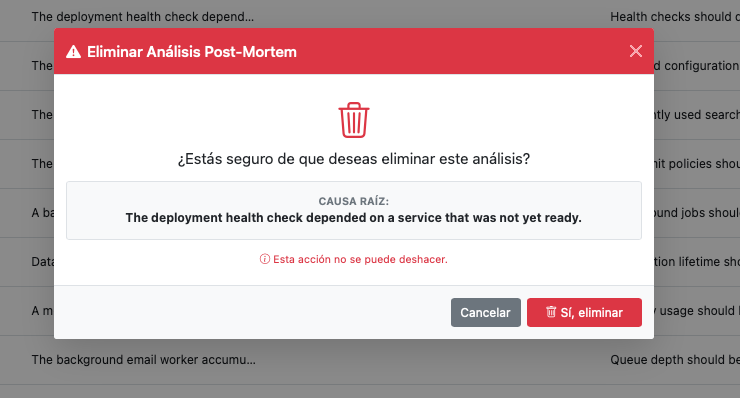
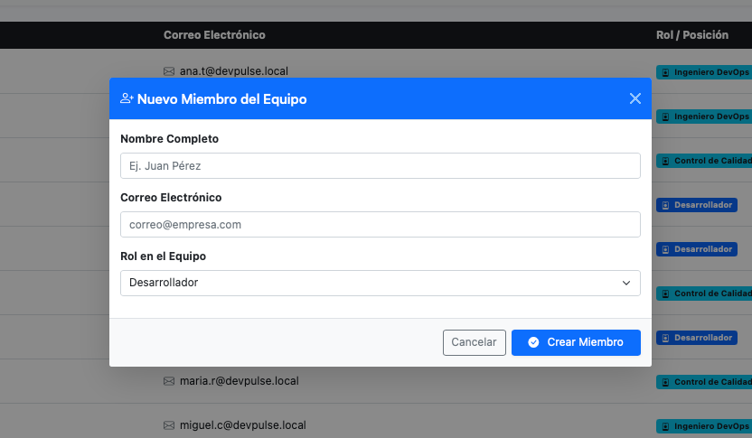
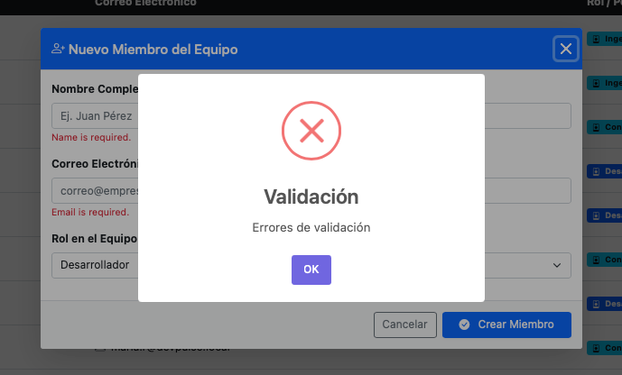
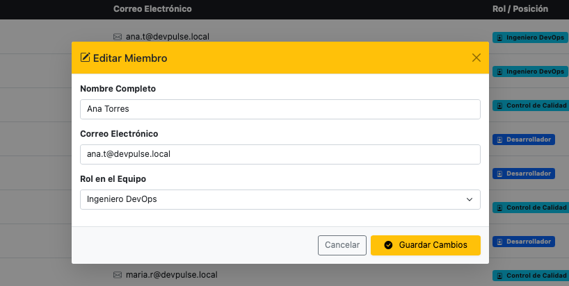
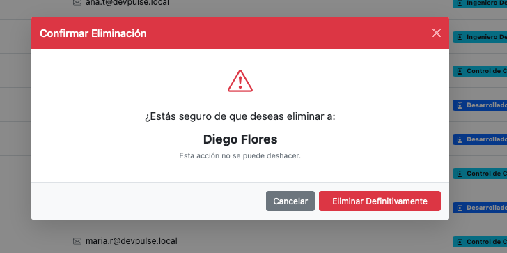

# 🚀 DevPulse - Incident & Resilience Management System

**DevPulse** es una solución empresarial de misión crítica diseñada para centralizar, gestionar y analizar incidentes tecnológicos. El objetivo principal es minimizar el tiempo de inactividad (Downtime) y fomentar una cultura de aprendizaje continuo mediante el análisis post-incidente.


## 💼 El Negocio: ¿Qué resuelve DevPulse?

En entornos de desarrollo y operaciones, los fallos son inevitables. DevPulse profesionaliza la respuesta ante estos fallos permitiendo:
1.  **Registro Inmediato:** Capturar incidentes con evidencias visuales.
2.  **Gestión de Equipos:** Asignar responsables según el rol (Dev, Ops, QA).
3.  **Análisis de Causa Raíz:** Documentar qué falló y cómo evitarlo en el futuro (Post-Mortems).
4.  **Auditoría y Trazabilidad:** Mantener un historial íntegro de quién hizo qué y cuándo.

---

## 🛠️ Funcionalidades del Sistema

### 1. Panel de Control (Dashboard)
Visualización global del estado operativo de la plataforma.
*   **Vistas principales:**
   *   Dashboard general: 

### 2. Gestión de Incidentes
El corazón del sistema. Permite el ciclo de vida completo de un fallo técnico.
*   **Listado y Búsqueda:** 
*   **Creación con Validaciones:** Control estricto de datos mediante FluentValidation.
   *   Formulario: 
   *   Validaciones en tiempo real: 
*   **Asignación de Personal:** Capacidad de delegar tareas a miembros específicos.
   *   Modal de asignación: 
*   **Evidencias:** Visualización de pruebas cargadas (Cloudinary).
   *   Vista de evidencia: 
*   **Mantenimiento:**
   *   Edición:  | Eliminación: 

### 3. Módulo de Post-Mortems
Herramienta analítica para documentar la "autopsia" de los incidentes cerrados.
*   **Módulo Principal:** 
*   **Filtros Dinámicos:** Búsqueda avanzada por causa raíz. 
*   **Creación y Gestión:**
   *   Registro: 
   *   Validaciones: 
   *   Edición:  | Eliminación: 

### 4. Gestión de Equipo (Team Members)
Administración del capital humano que responde a las emergencias.
*   **Gestión de Miembros:** 
*   **Registro de Talento:**
   *   Alta de miembro: 
   *   Validación de roles: 
*   **Mantenimiento:**
   *   Edición:  | Eliminación: 

---

## 🏗️ Arquitectura y Lógica de Aplicación

El sistema está construido bajo una **Arquitectura de Capas (N-Tier)**, garantizando el desacoplamiento mediante el uso intensivo de Interfaces en la capa de `Application`.

### Servicios Core (Interfaces)

El comportamiento del negocio está definido por contratos estrictos:

*   **`IIncidentService`**: Orquestador del ciclo de vida del incidente (Creación, búsqueda paginada, asignación de miembros y actualizaciones).
*   **`IPostMortemService`**: Gestiona la documentación post-incidente y filtros por causa raíz.
*   **`ITeamMemberService`**: Administra el catálogo de personal y sus roles dentro de la organización.
*   **`IFileStorageService`**: Abstracción para el manejo de archivos (implementado con **Cloudinary**), permitiendo `UploadImageAsync` y `DeleteImageAsync`.

### Stack Tecnológico
*   **Core:** .NET 8 (ASP.NET Core Razor Pages)
*   **Persistencia:** Entity Framework Core con PostgreSQL.
*   **Storage:** Cloudinary API para gestión de imágenes en la nube.
*   **Validación:** FluentValidation para lógica de negocio desacoplada de la UI.
*   **Frontend:** Bootstrap 5, jQuery y validación unobtrusive.
*   **Infraestructura:** Docker & Docker Compose para portabilidad total.

---

## 🚀 Instalación y Despliegue

### Requisitos
*   .NET 8 SDK
*   Docker Desktop
*   Credenciales de Cloudinary

### Ejecución Rápida (Docker)
```bash
docker-compose up --build
```

### Aplicar Migraciones Manuales
```bash
dotnet ef database update --project Infrastructure --startup-project Web
```

---
*Desarrollado con ❤️ en JetBrains Rider.*