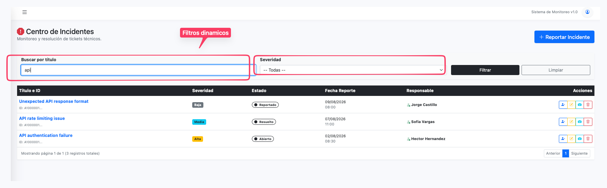
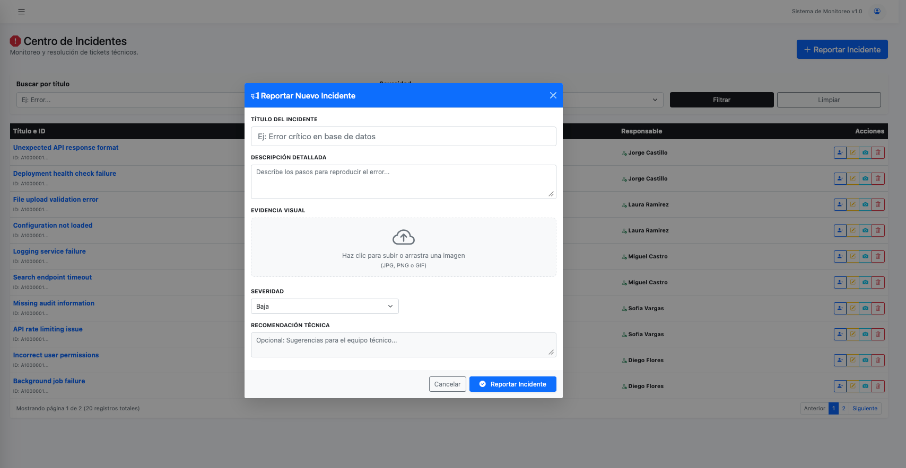
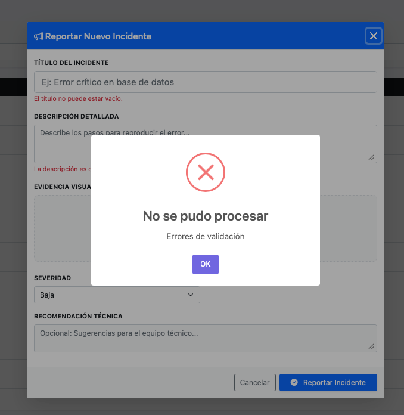
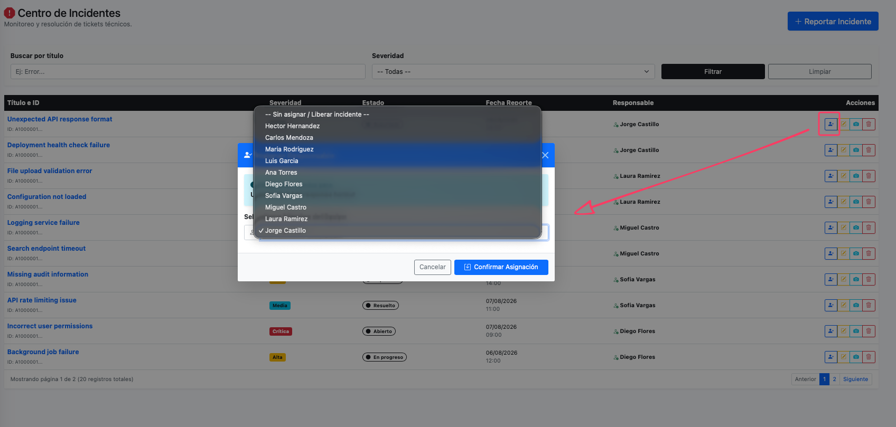
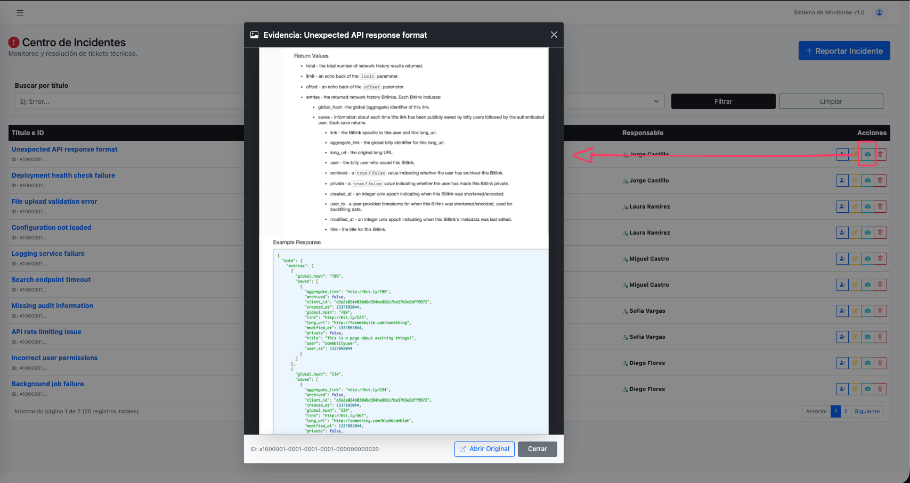
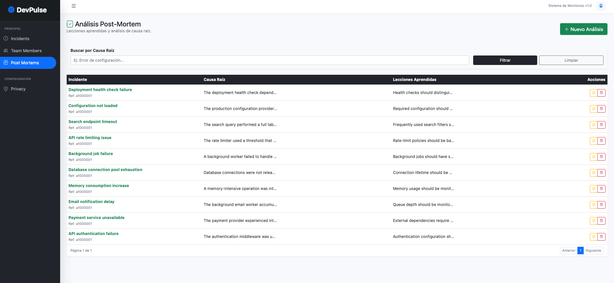
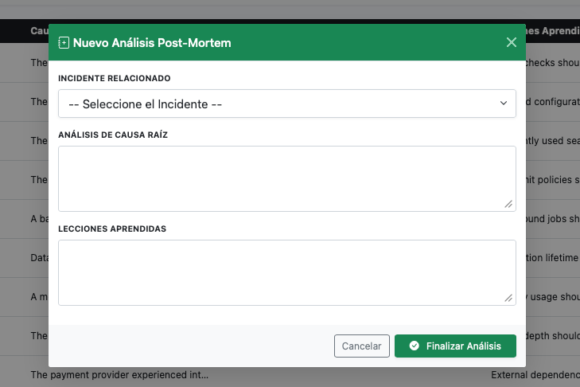
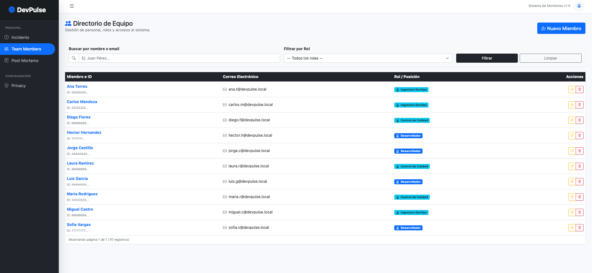

# 🚀 DevPulse - Incident & Resilience Management System

**DevPulse** es una plataforma de gestión de incidentes técnicos de alto rendimiento. A diferencia de las aplicaciones tradicionales de multipágina, DevPulse utiliza un patrón de **Partial-Rendering Asíncrono** para ofrecer una experiencia fluida de SPA (Single Page Application) sin la sobrecarga de frameworks pesados de frontend o librerías heredadas como jQuery.


## 💼 Valor de Negocio
DevPulse profesionaliza la respuesta operativa ante fallos:
*   **Ciclo de Vida de Incidentes:** Reporte, asignación de responsables y resolución.
*   **Gestión de Resiliencia:** Documentación de Post-Mortems con análisis de causa raíz para prevenir recurrencia.
*   **Almacenamiento en la Nube:** Integración nativa con Cloudinary para evidencias fotográficas de fallos.

---

## 🏗️ Arquitectura Técnica Avanzada

### 1. UX "SPA-like" con Vanilla JS & Razor Partials
El sistema implementa una arquitectura de comunicación fluida entre el servidor y el cliente:
*   **Zero jQuery:** Todo el frontend está construido con **Vanilla JS** nativo, utilizando `fetch` para peticiones asíncronas y manipulación directa del DOM.
*   **Partial View Updates:** El servidor no recarga la página completa. El `IndexModel` detecta flags `isPartial` para devolver únicamente el HTML necesario (`_IncidentList`), inyectándolo dinámicamente.
*   **Dynamic Modals:** Los formularios de creación, edición y borrado se cargan mediante `PartialViewResult` bajo demanda, optimizando el ancho de banda y la velocidad de carga inicial.

### 2. Gestión de Estado y Peticiones Asíncronas
Se utilizan técnicas modernas para garantizar la integridad y el performance:
*   **Antiforgery Tokens:** Manejo manual de tokens de seguridad en peticiones `POST` asíncronas mediante headers personalizados.
*   **FormData API:** Manejo nativo de archivos (screenshots) y datos complejos de formulario sin necesidad de serialización manual.
*   **Manual Error Mapping:** Los errores de validación del lado del servidor (FluentValidation) se devuelven como `JsonResult` y se mapean dinámicamente a los elementos del DOM.

---

## 📸 Recorrido Visual (Módulos)

### 🚨 Gestión de Incidentes
Control total sobre los fallos técnicos reportados.
*   **Centro de Incidentes (SPA View):** 
*   **Flujo de Creación (Modal Asíncrono):** 
*   **Validación de Negocio:** 
*   **Asignación de Expertos:** 
*   **Evidencias en la Nube:** 

### 🧠 Post-Mortems y Aprendizaje
*   **Módulo de Análisis:** 
*   **Filtros de Búsqueda Dinámica:** 
*   **Reportes Técnicos:** 

### 👥 Administración de Equipos
*   **Gestión de Roles y Miembros:** 

---

## 🛠️ Stack Tecnológico

| Capa | Tecnologías |
| :--- | :--- |
| **Backend** | .NET 8 (C#), Razor Pages |
| **Arquitectura** | N-Tier (Domain, Application, Infrastructure, Web) |
| **Frontend** | **Vanilla JavaScript (ES6)**, CSS3, Bootstrap 5 |
| **Base de Datos** | PostgreSQL (EF Core) |
| **Servicios** | Cloudinary API (Storage), FluentValidation |
| **UX/UI** | SweetAlert2 (Notificaciones), Partial Views (Razor) |
| **DevOps** | Docker, Docker Compose |

---

## 💻 Detalles de Implementación (Backend)

El core del sistema reside en el `IndexModel.cs`, que gestiona múltiples verbos y acciones mediante **Named Handler Methods**:

```csharp
// Ejemplo de carga dinámica de tabla sin recargar página
public async Task<IActionResult> OnGetAsync(bool isPartial = false)
{
    var query = new IncidentQueryDto(SearchName, FilterSeverity, CurrentPage, PageSize);
    var pagedResult = await _incidentService.GetAllIncidentsAsync(query); 
    
    Incidents = pagedResult.Items;
    
    return isPartial ? Partial("_IncidentList", this) : Page();
}

// Ejemplo de retorno JSON para validación y feedback
public async Task<IActionResult> OnPostCreate(IncidentFormViewModel viewModel)
{
    // Lógica de carga a Cloudinary e inserción...
    return new JsonResult(new { success = result.IsSuccess, message = result.Message, errors = result.ErrorsValidations });
}
```

---

## 🚀 Despliegue con Docker

1. **Construir y levantar:**
   ```bash
   docker-compose up --build
   ```
   *Esto levantará el contenedor de la aplicación ASP.NET y la base de datos PostgreSQL.*

2. **Acceso:**
   La aplicación estará disponible en `http://localhost:5000`.

---
*Desarrollado con arquitectura limpia y performance de alto nivel en JetBrains Rider.*
